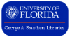

((title . "MassMine: About"))

### Project Team

MassMine was created by [Nicholas Van Horn](http://www.nicholasvanhorn.com) and [Aaron Beveridge](https://ufl.academia.edu/AaronBeveridge). MassMine is a TRACE Innovation Initiative, and the project is supported by the George A. Smathers Libraries and Research Computing at the University of Florida. 

MassMine's entire project team, advisory board, and scholary contributors can be seen here---in our recent [National Endowment for the Humanities](http://ufdc.ufl.edu/AA00025642/00001/pdf) grant application. 

**We would like to give special thanks to the following people for substantial and ongoing support of/contribution to the project:**

  
  
  

* Sidney Dobrin---Director of TRACE at UF
* Laurie Taylor---Digital Humanities Librarian at UF
* Matthew Gitzendanner---Research Computing at UF
* Kenneth Kidd---Chair of English Dept. at UF
* Sean Morey---Professor of English at Clemson University
